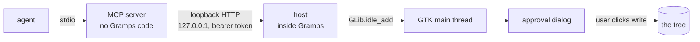

# gramps-live-api

[](https://github.com/randyjreid/gramps-live-api/actions/workflows/ci.yml)

**An MCP server that lets an agent propose structured changes to a live desktop application's
database, with a human approving every write.**

The application is [Gramps](https://gramps-project.org/), a genealogy program. The agent reads a
document, works out what it says, and proposes the whole of it as one graph; the user reads a
preview inside Gramps and approves or cancels. Single user, on their own machine.

Give the agent a genealogical record or document: a census page, or a birth, marriage or death
certificate. It reads it, works out what it says about people in the user's tree, checks what is
already recorded, and proposes every change at once: new people, events, places, the source, the
citation. The user reads the whole thing in one dialog and approves it or cancels it. One decision,
not twenty.

What is built and what is still a plan is set out below, and
[`docs/STATUS.md`](docs/STATUS.md) is the dated statement of where the project stands.

## What it looks like

In this example, a census page produces one dialog, and the user reads it before anything is
written. Below is a real render: invented names, produced by the same `preview()` the
dialog calls, so it is exactly what the window shows.

```
THIS IS WHAT WOULD BE WRITTEN TO YOUR TREE
==============================================================

ATTACHING TO EXISTING

  I0042  Aubertin, Theodore (b. 1861)
        already has: Census, 1880 · Census, 1890
      + Census, 1900-06-04, at Invented Township -- occupation:
      wheelwright
      + Citation -> Invented County Census, 1900  p.sheet 4B, line 12

  F0007  Aubertin, Theodore + Aubertin, Marguerite
      + adding as children: Emil Aubertin

CREATING NEW

  Source  Invented County Census, 1900

  Person  Marguerite Aubertin   [unknown]
      + Census, 1900-06-04, at Invented Township
      + Citation -> Invented County Census, 1900  p.sheet 4B, line 12

  Person  Emil Aubertin   [unknown]
      + Census, 1900-06-04, at Invented Township
      + Citation -> Invented County Census, 1900  p.sheet 4B, line 12

  Place   Invented Township

--------------------------------------------------------------

  The people under CREATING NEW are made fresh. Nothing is matched by name
  -- if one of them is already in your tree, you get a second copy.

Nothing already in your tree is modified. Existing objects are only
added to.

Write it writes all of the above, in ONE transaction.
Cancel writes nothing at all.
```

**What to notice.** The name beside `I0042` is read from the tree, not from the proposal, so a
wrong identifier shows up as the wrong person. `already has:` lists what that record holds of the
types being added, so a second Census does not look like a first. A field the write would drop (a
name supplied alongside a Gramps ID, say) is listed as dropped rather than written over what Gramps
already holds. And one graph is one approval, and one transaction.

## How it fits together



**Two things to take from it.** ⛔ **The agent can ask for the dialog to open, and then knows
nothing more.** It holds no reference to the window, cannot put text into it, cannot read what it
displays, and the call that opened it returns without saying what was decided. ⛔ **On this route no
write reaches the tree until the user clicks**, and the click is the only path to `F`.

⭐ **And it is now a claim about every write there is.** The `apply` CLI command and the older
`approve` console flow wrote by other paths and neither took a backup; R9 retired both, so the
document route is the only write path an agent can reach.

⚠️ **Reads do reach the database before the click, and the distinction is the whole safety property.**
The dialog's text is built by reading the tree (the name behind each Gramps ID, what those records
already hold), the totals are read, and a verified backup is taken, all before the window opens. That
is what makes the preview worth reading. **What the click gates is the write, not the access.**

## The shape, in thirty seconds

**Two processes.**

1. **An MCP server**, speaking **stdio only**. It holds no Gramps code and never touches a database.
2. **A Gramps addon**: a plugin Gramps loads at startup, which runs a **loopback HTTP listener**
   (`127.0.0.1`, ephemeral port, bearer token) on a background thread *inside the Gramps process*.

The MCP server is a thin client of that listener. Every database read and every GTK touch is
marshalled onto Gramps' own main thread, because that is the only thread Gramps permits them on.

The listener is deliberately hostile to anything that is not that client: a request carrying an
`Origin` header is refused before anything else, a missing or wrong bearer token is refused before
the route is even looked at, and a main thread that does not answer in time returns a refusal rather
than holding the socket open.

**The approval model is the point.** An agent can propose. It cannot write, and it cannot learn
whether the user said yes:

The **document** flow renders a preview from the stored proposal and shows it in a **modal GTK
dialog inside Gramps**. The dialog's text is built from the record on disk and from the tree, never
from anything an agent sends at approval time.

⚠️ **It is the only approval surface, and it used to be the weaker of two.** The retired note flow
opened a **console window in a separate process**, which this server held no handle on and could not
type into. R9 accepted the loss of that argument as a stated cost of retiring the flow.

The call that opens the approval returns immediately and knows nothing. **The approval response does
not reveal the decision**: not written, not declined, not failed.

**That is a property of the response, not a guarantee of secrecy.** The live-read tools are still
there, so an agent can look afterwards (asking for a distinctively named person, or for what changed
since a moment ago) and infer that a write happened. What it cannot do is *be told*, and it cannot
learn anything from a refusal it could not have learned by reading.

## Getting started

Windows PowerShell, from a checkout. [`docs/using.md`](docs/using.md) has the full steps and the
things that go wrong; this is the shape of it.

```powershell
python -m venv .venv
.\.venv\Scripts\python.exe -m pip install -e ".[mcp]"
claude mcp add gramps -- "$PWD\.venv\Scripts\python.exe" -m gramps_live_api_mcp
```

If the first line prints a Microsoft Store message instead of doing anything, that is the Store
alias rather than Python: no `.venv` appears, and `docs/using.md` has the remedy.

**Three things have to be true before any of it works**, and none of them is something this
project can do for you:

1. **Gramps is running, with the tree open.** The addon lives inside that process; there is nothing
   to talk to when Gramps is closed.
2. **The addon is registered**: a junction from Gramps' user plugin folder to this checkout's
   `gramps_plugin/`, so Gramps loads the host at startup.
3. **The tree carries a `.gramps-live-api-copy` sentinel**, placed by hand. Without it every write
   is refused, and that is the whole permission model.

⚠️ **`.\.venv\Scripts\python.exe -m gramps_live_api check` does not report on the first of
those, and cannot.** It reads the filesystem: the tree directory, the sentinel, the installed
runtime, the plugin, and the push hook. It never contacts a running host, and it treats the tree's
`lock` file as a **failure**, because a locked tree is one Gramps is holding, and it will not break
that lock. **Run it with the tree CLOSED.** `docs/using.md` explains what each answer means.

## Compatibility

**This is a stdio MCP server built on the official Python SDK.** Which clients it
has actually been used with, and which it has not, stated separately: ⛔ **no
client is claimed here that nobody has run.**

| client | status |
| --- | --- |
| **Claude Code** | ⭐ **used throughout development.** Every example in these docs is this client. |
| **Codex CLI 0.146.0** | ⭐ **tested.** `codex mcp add <name> -- <python> -m gramps_live_api_mcp` registers it as a stdio server; the tool is discovered and invoked, and returns the server's own envelope. |

⚠️ **Codex needs its sandbox opened, or the first call fails and reads like a
broken server.** Under its defaults (`sandbox: read-only`, `approval: never`)
the call is auto-denied with `user cancelled MCP tool call`, which says nothing
about MCP and everything about the sandbox. Grant approvals for the call, or run
with a sandbox that permits it.

⛔ **Two things about Codex are NOT known**, because they were not measured:
whether it truncates tool descriptions at the same 2,048 characters Claude Code
does (the budget in the code was measured against Claude Code only) and whether
it surfaces MCP **prompts**, which is how this server ships its getting-started
guidance.

**Other clients, by protocol only.** MCP's own documentation names Claude,
ChatGPT, VS Code, Cursor and MCPJam. A client that supports local stdio servers
should register this one with its own equivalent of the command above. ⛔ **None
of them has been run against this server, so none is claimed.**

## What the agent can do

The tools, in two groups.

**Live reads of the open tree**: `find_people`, `find_place`, `find_source`, `find_citation`,
`find_families`, `find_orphans`, `list_events`, `list_family_events`, `list_citations`,
`list_associations`, `list_notes`, `tree_totals`, `tree_name`, `changed_since`. These answer from the database
Gramps currently has open.

`find_families` is its own tool and is the one to run before adding children or a family event;
missing it is how a second household gets created for a couple who already have one.

**The document pair**: `propose_document` and `approve_document`. The first files a whole graph
server-side and returns an id and a preview; the second opens the user's approval. A graph may
create people, places, events, families, sources, citations and notes, and may attach citations and
notes to records that already exist. **One graph is one approval and one transaction.**
[`docs/census-brief.md`](docs/census-brief.md) is the working brief for driving them over a census.

**The preview the agent gets and the one the user sees are different, and that difference is
the identity check.** What comes back to
the agent shows only the Gramps IDs it supplied. What the user sees is rendered independently at
approval time: the names read from the live tree, and every field the write will drop shown as
dropped. So a wrong ID is something the user can catch and the agent cannot paper over.

**A node carrying a Gramps ID keeps its own descriptive fields. That is the whole guarantee, and
it is narrower than "not modified".** Such a record *is* committed to: an event reference can be
added to a person, children to a family, a citation or note to any of them. What is ignored is what
the payload says the record *is*: its name, type, date, place. Anything dropped that way is shown
in the preview as dropped.

⛔ **There was a third group and it is retired.** `propose_note`, `approve` and `list_people` were
the terminal-era path: a note written into a blessed copy, approved in a console window, targeting a
person looked up in a **Gramps XML export produced by hand** — a snapshot that could not see writes
made since it was taken, and would not reflect a privacy flag set afterwards. R9 retired all three.
`find_people` is the live equivalent of the lookup and was already the one to use.

The set above is not maintained by hand against the server: `tests/unit/test_mcp_server.py`'s
`test_the_exposed_surface_is_exactly_what_the_server_says_it_is` asserts the exposed surface is
exactly what the server publishes.

## The honest status

- **The sentinel is the whole permission model.** A tree is writable only if it carries a
  `.gramps-live-api-copy` file placed there by hand. There is no flag and no config key that
  overrides it.
- **That blessing has been used on the tree holding real data**, and writes have gone into it.
  Earlier work wrote only into a blessed copy.
- ⚠️ **The safety property was deliberately downgraded** to make that possible. It was *unwritable by
  construction*: the live tree could not be a target at all. It is now **recoverable after**, and
  only on one route: before a **document** write, a backup is taken, verified with SQLite's own
  integrity check, and recorded in a journal. **That is a weaker guarantee.** It was ruled
  deliberately, and the preconditions it was granted under are met.
- **A journal that names a backup time and no write time still names the backup a restore needs, but
  it does not tell you whether anything was written: a missing write time does not mean the tree is
  unchanged.**
  [`docs/restoring.md`](docs/restoring.md#what-intent-only-means-and-what-it-does-not) has the detail.
- ⭐ **Every write path takes the backup now**, which this page could not say before R9. The note
  flow (`propose_note`/`approve`) and the `preview`/`apply` commands wrote without taking one, so a
  write through those paths had **no recovery point**. They are retired, and the document route is
  what is left.
- **The approval dialog's `already has:` line is read through the privacy gate, like every other
  read.** For each attached person the proposal adds an event to, the dialog lists what they already
  hold of the types being added, so a second event of a kind they already have no longer looks like
  a first. ⚠️ **A record the tree marks private is not in that list, and the agent's own lookup
  cannot see it either**: the two checks share one blind spot rather than covering each other. A
  public person with a private Birth event reads as holding none, on both sides.
- **The core has `dependencies = []`** and runs on the standard library alone. The official MCP SDK
  sits behind an optional `mcp` extra, and installing it brings 27–30 packages with it, measured.
  what that costs, and why the SDK anyway, is in [`docs/slice2-mcp.md`](docs/slice2-mcp.md).

**Four active issues.** The rest are review findings nobody has hit, labelled `untriggered` and not
scheduled, 68 of the 72 open. [`docs/STATUS.md`](docs/STATUS.md) ranks the four and says why the
68 are a decision rather than a backlog.

### What is tested, and against what

⚠️ **Two different things get called "a real tree" on pages like this, and they are
not the same claim.** A **real Gramps database** is one a test creates, throws away,
and can drive automatically. **A user's own tree** is the one that matters, and
nothing automated ever touches it.

Coverage is heavy on the parts that can run without Gramps: the graph parser and its refusals, the
preview renderer, the privacy gate, the backup machinery, the guard. Those have real tests, most with
negative controls that are checked to fail when the behaviour is removed.

⚠️ **The seam is thin, and exactly how thin is worth stating.** All the live-read tools are
invoked **through the registered MCP wrappers** against a **fake host**, each asserted to reach its
own route, with its own parameters, its defaults for the arguments a caller omits, and its bearer
token, together with the three ways the transport fails: no host running, a host that refuses, a
host that is unreachable.

⛔ **The two that write are not: `propose_document` and `approve_document`.** Their logic is
exercised one layer down, against fakes, in the accessor and document modules. (This said *five*
until R9; the other three were the note flow's, and they are gone.)

⚠️ **And a fake host is not Gramps.** That a route is called with the right parameters says nothing
about what the tree would answer. The wiring from an MCP call, through the **real** HTTP listener,
onto Gramps' main thread and back is still proved by a person running it, not by the suite.

**Against a real Gramps database, one thing is covered automatically, and it is the strongest
evidence here.** An integration test creates a **throwaway** Gramps database, files a document
through the real `propose_document`, claims it the way `approve_document` does, and runs the
**document route's own writer** through a real `DbTxn` in a real Gramps process — then verifies the
person, the note, its type and the citation from a second fresh process. It runs only when pointed at
an installed Gramps runtime, so it is skipped in CI, but it is automated, and the database is real.

⚠️ **It drove the note flow's write until R9, and the port kept the property while losing half the
route.** What it cannot reach is `approve_document`'s loopback POST and the modal dialog behind it:
the dialog writes only when a person clicks, and a test that could click it would be an
auto-approving path built into the product.

**Against a real Gramps database, these are not covered at all:** the plugin registration, the
approval dialog, the backup and journal, and every live read. A fake host proves the MCP layer calls
the right route; only a database can say what comes back.

⛔ **And against a user's own tree, nothing is automated, not one of the above.** Every write and
every read into the tree they actually work in is exercised by a person, watching. That is deliberate
and it is not going to change.

## Where it is going

**Every one of these is a plan, not a feature**, and there are no dates because none exist.

- **The census demo itself**: the sentence at the top of this page, end to end. *"Not twenty"* is
  the part already standing: the document route takes a whole graph, shows one preview, and writes it
  in one transaction. What is untested is whether a real census document survives that route
  end to end.
- ⭐ **A dialog that shows what the tree already holds, and this has shipped**, and is listed above under
  what the dialog does rather than here. What remains of it is the blind spot: a record the tree marks
  private is invisible to that line, and to the agent's own lookup, so the two share it.
- **Then**, as a pool of specified work rather than a schedule: a richer read surface, media, and
  record matching.

Two rulings shaped what exists now, both the project owner's: **Gramps stays open**, and **the tool runs as a
Gramps addon inside the Gramps process**. That addon is written. The ruling is
[`docs/rulings/R8-channel-architecture.md`](docs/rulings/R8-channel-architecture.md).

**One requirement no page can retire:** nothing should be written to a tree the user cannot get
back. The backup path exists and verifies itself; watching a restore actually come back is the
user's to do, and [`docs/restoring.md`](docs/restoring.md) is the procedure.

**[`docs/STATUS.md`](docs/STATUS.md) is the current statement of where the project stands.**
[`docs/roadmap.md`](docs/roadmap.md) has not kept up with this page and should be read as
history, not as the current plan. It still describes three MCP tools, writes that only ever target
a copy, and the addon as unwritten, all of which this page contradicts, and the source contradicts
with it. It is left in place because the rulings and open questions it records are still the real
ones.

## Running the gates

With `".[dev,mcp]"` installed, from the checkout root:

```sh
ruff check .
ruff format --check .
mypy src
pytest -rs
```

`-rs` names every skipped test and its reason, which matters here: an unseen skip reads exactly like a
pass. `CONTRIBUTING.md` has the fifth gate (the privacy guard) and how to run it over a push.

CI runs those on Python 3.10, 3.11 and 3.12 in two legs over the same tree: a **core** leg that
refuses to continue if `mcp` is importable or if this distribution declares a single unconditional
requirement, and an **mcp** leg that installs the extra and refuses a run whose MCP tests did not
actually execute. A third job runs the guard.

**Green CI is not evidence the write path works.** The runners have no Gramps, no `gi` and no tree,
so the write, the plugin registration and the read-back cannot be observed there at all: those tests
skip, by name, in the log. It is why every demo ends with a person looking at the tree, and it is why
`src/` imports no `gramps` and no `gi`: the files that must are a top-level `gramps_plugin/`, outside
the package and never imported by it. Gramps loads them; we do not.

## Privacy

This repository is public. The family tree it is built for is not, and no part of it will ever be
committed here. A guard (`src/gramps_live_api/core/pii_guard.py`) fails the build on absolute
filesystem paths that identify a person or a machine, and on genealogy data, refusing outright any
file type it cannot prove safe. Three things about it are deliberate: it scans **what Git contains**
rather than the working tree, because a push publishes every commit it holds; it **fails closed**,
because it cannot know every genealogy format that exists; and in CI it **redacts what it matched**,
because a build log is as public as the repository. It does not scan for credentials.
`CONTRIBUTING.md` has the reasoning: read it before adding a fixture or a new file type.

Separately, and **by design**: the read tools put tree content into a model's context, and **not only
about people**. Source titles and authors, citation pages, event descriptions, note text and the text
of orphaned records all come back as themselves: anything a read tool can return, it returns. That is
bounded by the tree's own `priv="1"` flag, by a required search term, and by a result cap. It is bounded by nothing else, and text that has reached a model's context has reached
it.

**The privacy flag hides contents, not existence, and the difference is deliberate.** A **live**
listing never includes a private record. But a record asked for **by name** is refused with a
distinct refusal rather than reported absent, so a caller that already has an identifier can learn
that the record exists, while learning nothing in it. That was chosen so the user is told *this is
private* instead of *this is not here*, and the cost is exactly that disclosure.

⭐ **There is no longer an exemption to that, and there was one.** `list_people` read a Gramps XML
export, so a person marked private *after* that export was taken was still listed by it and still
accepted as a target — a fail-open the `check` command had to report as a doctor failure rather than
a warning. R9 retired the tool, the export and the setting together, and every read now goes through
the accessor against the tree Gramps has open.

## Licence

GPL-2.0. A Gramps addon imports Gramps and is a derivative work of it, so the licence is not a choice
this project gets to make. See `LICENSE`.
